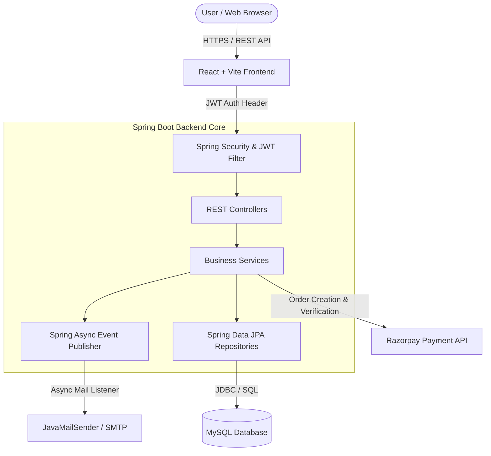

<div align="center">

# 🌉 Seva Setu (सेवा सेतु)
### *Bridging Compassion with Impact — A Transparent Social Impact & Donation Management Platform*

[](https://spring.io/projects/spring-boot)
[](https://react.dev/)
[](https://vitejs.dev/)
[](https://www.mysql.com/)
[](https://razorpay.com/)
[](https://jwt.io/)
[](#license)

</div>

---

## 📌 Table of Contents
- [📖 Overview](#-overview)
- [✨ Key Features](#-key-features)
- [🏛️ System Architecture](#️-system-architecture)
- [👥 Role-Based Access Control (RBAC)](#-role-based-access-control-rbac)
- [🛠️ Tech Stack](#️-tech-stack)
- [📂 Project Directory Structure](#-project-directory-structure)
- [🚀 Quick Start & Installation](#-quick-start--installation)
  - [Prerequisites](#prerequisites)
  - [Backend Setup (Spring Boot)](#1-backend-setup-spring-boot)
  - [Frontend Setup (React + Vite)](#2-frontend-setup-react--vite)
- [🔐 Environment Variables & Security](#-environment-variables--security)
- [📡 API Endpoints Summary](#-api-endpoints-summary)
- [🛢️ Database Schema Overview](#️-database-schema-overview)
- [📄 License](#-license)

---

## 📖 Overview

**Seva Setu** (सेवा सेतु) is an end-to-end, full-stack digital platform designed to bring **transparency, accountability, and real-time tracking** to charitable donations and community relief operations.

Traditional donation drives often suffer from a lack of transparency regarding how monetary and item donations are utilized. Seva Setu solves this by connecting verified NGOs/Institutions directly with Donors and Volunteers through an audited workflow:
1. **Verified Institutions** post specific community **Needs** (Monetary or Item-based).
2. **Donors** fund needs via secure **Razorpay Integration** or pledge item donations.
3. **Volunteers** manage pickup & delivery logistics for physical items.
4. **Institutions** submit **Proof of Impact** (receipts, delivery photos, beneficiary documentation), giving donors complete visibility into their impact.

---

## ✨ Key Features

### 🔐 1. Authentication & Security
- **JWT Stateless Authentication**: Secure token handling with custom expiration windows.
- **Role-Based Guards**: Dynamic front-end & back-end route protection (`ProtectedRoute`, `RoleGuard`).
- **Encrypted Password Storage**: BCrypt password hashing.

### 🎯 2. Community Needs Management
- Multi-category classification: *Education, Healthcare, Disaster Relief, Hunger, Shelter, Elder Care, Environment*.
- Urgency Badging: `LOW`, `MEDIUM`, `HIGH`, `CRITICAL`.
- Visual Progress Indicators: Real-time calculation of target vs. raised funds/items.

### 💳 3. Payment Gateway & In-Kind Donations
- **Razorpay Payment Integration**: Order creation, signature verification, and instant receipt generation.
- **Item/In-Kind Donations**: Track physical goods from pickup to beneficiary delivery.

### 🚚 4. Logistics & Volunteer Coordination
- Volunteer task assignment for item pickups.
- Status workflow: `PENDING` ➔ `ACCEPTED` ➔ `IN_TRANSIT` ➔ `DELIVERED`.

### 📊 5. Transparent Proof of Impact
- Institutions upload post-fulfillment proof photos & descriptions.
- Donors view an interactive **Donation Timeline** from initial contribution to verified impact.

### 🛡️ 6. Admin Control Panel
- NGO/Institution credential verification & license audit.
- Global system stats, user role management, and automated test data seeding (`DataSeeder`).

---

## 🏛️ System Architecture



---

## 👥 Role-Based Access Control (RBAC)

| Feature / Module | 👤 Donor | 🏢 Institution | 🤝 Volunteer | 🛡️ Admin |
| :--- | :---: | :---: | :---: | :---: |
| Browse Public Needs | ✅ | ✅ | ✅ | ✅ |
| Make Monetary & Item Donations | ✅ | ❌ | ❌ | ❌ |
| View Personal Donation Timeline | ✅ | ❌ | ❌ | ❌ |
| Create & Manage Community Needs | ❌ | ✅ | ❌ | ❌ |
| Submit Proof of Impact | ❌ | ✅ | ❌ | ❌ |
| Accept & Manage Logistics Tasks | ❌ | ❌ | ✅ | ❌ |
| Verify NGO Registrations | ❌ | ❌ | ❌ | ✅ |
| System Performance Dashboard | ❌ | ❌ | ❌ | ✅ |

---

## 🛠️ Tech Stack

### **Backend Framework**
- **Java 17** & **Spring Boot 3.x**
- **Spring Security** (JWT Authentication & Authorization)
- **Spring Data JPA** (Hibernate ORM)
- **MySQL 8.0** Database
- **Razorpay Java SDK** (Payment Gateway)
- **JavaMailSender** & Async Event System (Email Notifications)
- **Maven** (Dependency Management)

### **Frontend Framework**
- **React 18** (Functional Components & Hooks)
- **Vite 6** (Build Tool & Dev Server)
- **React Router v6** (Client-side Routing)
- **Axios** (HTTP Client with Interceptors)
- **Context API** (Global Auth & Toast State)
- **Vanilla CSS & Tailwind Utilities** (Fluid, Modern UI)

---

## 📂 Project Directory Structure

```text
SevaSetu/
├── backend/                        # Spring Boot Microservice
│   ├── src/
│   │   ├── main/
│   │   │   ├── java/com/sevasetu/
│   │   │   │   ├── config/         # SecurityCors, Async, Razorpay, DataSeeder
│   │   │   │   ├── controller/     # REST Endpoints (Auth, Need, Donation, etc.)
│   │   │   │   ├── dto/            # Request/Response Data Transfer Objects
│   │   │   │   ├── entity/         # JPA Entities (User, Need, Donation, etc.)
│   │   │   │   ├── enums/          # System Enums (Role, Statuses, Urgency)
│   │   │   │   ├── event/          # Async Spring Application Events
│   │   │   │   ├── exception/      # Global Exception Handler & Custom Errors
│   │   │   │   ├── listener/       # Email & Event Listeners
│   │   │   │   ├── repository/     # Spring Data JPA Interfaces
│   │   │   │   ├── security/       # JWT Filters & UserDetailsService
│   │   │   │   ├── service/        # Business Logic Implementations
│   │   │   │   └── util/           # JWT Tokens & Helpers
│   │   │   └── resources/
│   │   │       └── application.properties # App Config & DB Properties
│   └── pom.xml                     # Maven Dependencies
│
├── frontend/                       # React Single Page Application
│   ├── public/                     # Static Favicons & Icons
│   ├── src/
│   │   ├── api/                    # Axios API Modules (auth, need, donation, etc.)
│   │   ├── assets/                 # SVGs & Images
│   │   ├── components/             # Reusable UI (Navbar, Cards, Modals, Badges)
│   │   ├── context/                # AuthContext & ToastContext
│   │   ├── hooks/                  # Custom React Hooks (useAuth)
│   │   ├── pages/                  # Views grouped by Role (donor, admin, etc.)
│   │   ├── utils/                  # Constants & Helpers
│   │   ├── App.jsx                 # Route Declarations & Router Setup
│   │   └── main.jsx                # DOM Entry Point
│   ├── package.json                # NPM Dependencies
│   └── vite.config.js              # Vite Bundler Config
│
├── .gitignore                      # Root Git Ignore Rules
└── README.md                       # Comprehensive Project Documentation
```

---

## 🚀 Quick Start & Installation

### Prerequisites
- **Java JDK 17** or higher
- **Node.js 18.x** or higher & **npm**
- **MySQL 8.0** Server
- **Git**

---

### 1. Backend Setup (Spring Boot)

1. **Navigate to the backend directory**:
   ```bash
   cd backend
   ```

2. **Create MySQL Database**:
   Log into MySQL and execute:
   ```sql
   CREATE DATABASE SevaSetuDB;
   ```

3. **Configure Environment Variables / Properties**:
   Open `src/main/resources/application.properties` and adjust your credentials:
   ```properties
   spring.datasource.url=jdbc:mysql://localhost:3306/SevaSetuDB
   spring.datasource.username=root
   spring.datasource.password=your_mysql_password

   jwt.secret=YourSuperSecretKeyForJWTTokenGenerationLengthAtLeast32Bytes

   razorpay.key.id=YOUR_RAZORPAY_KEY_ID
   razorpay.key.secret=YOUR_RAZORPAY_KEY_SECRET

   spring.mail.username=your_email@gmail.com
   spring.mail.password=your_app_password
   ```

4. **Build and Run Backend**:
   ```bash
   mvn clean spring-boot:run
   ```
   The API server will start on **`http://localhost:8080`**.

---

### 2. Frontend Setup (React + Vite)

1. **Navigate to the frontend directory**:
   ```bash
   cd frontend
   ```

2. **Install Node Dependencies**:
   ```bash
   npm install
   ```

3. **Configure `.env` file** (optional):
   ```env
   VITE_API_BASE_URL=http://localhost:8080/api
   ```

4. **Start Vite Development Server**:
   ```bash
   npm run dev
   ```
   Access the web app at **`http://localhost:5173`**.

---

## 🔐 Environment Variables & Security

> [!IMPORTANT]
> Never commit confidential API credentials or database passwords to public repositories. Always use environment variables in production deployments:

| Variable | Description | Default Fallback |
| :--- | :--- | :--- |
| `DB_URL` | MySQL Connection JDBC URL | `jdbc:mysql://localhost:3306/SevaSetuDB` |
| `DB_USERNAME` | MySQL DB User | `root` |
| `DB_PASSWORD` | MySQL Password | `YOUR_DB_PASSWORD` |
| `JWT_SECRET` | 256-bit Key for JWT Signing | `YOUR_JWT_SECRET_KEY` |
| `RAZORPAY_KEY_ID` | Razorpay Sandbox/Live Key | `YOUR_RAZORPAY_KEY_ID` |
| `RAZORPAY_KEY_SECRET` | Razorpay API Secret | `YOUR_RAZORPAY_KEY_SECRET` |
| `MAIL_USERNAME` | SMTP Email Sender Address | `YOUR_MAIL_USERNAME` |
| `MAIL_PASSWORD` | SMTP App Password | `YOUR_MAIL_APP_PASSWORD` |

---

## 📡 API Endpoints Summary

### 🔑 Authentication (`/api/auth`)
- `POST /api/auth/register/donor` — Register a Donor
- `POST /api/auth/register/institution` — Register an NGO/Institution
- `POST /api/auth/register/volunteer` — Register a Volunteer
- `POST /api/auth/login` — Authenticate & receive JWT Token

### 🎯 Needs (`/api/needs`)
- `GET /api/needs` — List public community needs (with category/urgency filter)
- `GET /api/needs/{id}` — Fetch details of a specific need
- `POST /api/needs` — Create a new need (*INSTITUTION only*)
- `PUT /api/needs/{id}` — Update need details (*INSTITUTION owner*)

### 🎁 Donations & Impact (`/api/donations`)
- `POST /api/donations` — Create a monetary or item donation
- `GET /api/donations/my` — Get current donor's donation history
- `POST /api/donations/{id}/proof` — Upload Proof of Impact (*INSTITUTION*)
- `GET /api/donations/{id}/timeline` — Track donation lifecycle

### 💳 Payments (`/api/payments`)
- `POST /api/payments/create-order` — Initialize Razorpay order
- `POST /api/payments/verify` — Verify Razorpay payment signature

### 🚚 Logistics & Volunteers (`/api/logistics`)
- `POST /api/logistics/assign` — Assign item pickup to volunteer
- `PUT /api/logistics/{id}/status` — Update transit status (*VOLUNTEER*)

### 🛡️ Admin (`/api/admin`)
- `GET /api/admin/institutions/pending` — List pending NGO approvals
- `PUT /api/admin/institutions/{id}/verify` — Approve/Reject NGO registration

---

## 🛢️ Database Schema Overview

```text
+---------------+       +------------------+       +-------------------+
|     USERS     |       |   INSTITUTIONS   |       |       NEEDS       |
+---------------+       +------------------+       +-------------------+
| id (PK)       | <---> | id (PK)          | <---> | id (PK)           |
| email         |       | user_id (FK)     |       | institution_id(FK)|
| password      |       | org_name         |       | title, target_amt |
| role          |       | license_number   |       | raised_amount     |
+---------------+       | verification_stat|       | status, category  |
                        +------------------+       +-------------------+
                                                             |
                                                             v
+---------------+       +------------------+       +-------------------+
|  PROOFS OF    |       |    PAYMENTS      |       |     DONATIONS     |
|    IMPACT     | <---> | id (PK)          | <---> | id (PK)           |
+---------------+       | razorpay_order_id|       | donor_id (FK)     |
| id (PK)       |       | payment_status   |       | need_id (FK)      |
| image_url     |       +------------------+       | amount, status    |
+---------------+                                  +-------------------+
```

---

## 📄 License

Distributed under the **MIT License**. See `LICENSE` for more information.

---

<div align="center">
  <b>Made with ❤️ for Community Impact & Social Good</b>
</div>
